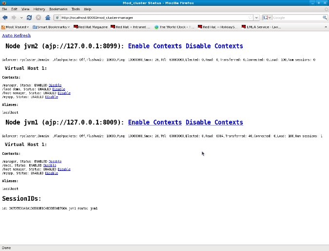

# 第三章 httpd 配置

## 3.1. Apache httpd 配置

你需要像下例所示加载 mod_cluster 需要的模块：

```
LoadModule proxy_module modules/mod_proxy.so
LoadModule proxy_ajp_module modules/mod_proxy_ajp.so
LoadModule slotmem_module modules/mod_slotmem.so
LoadModule manager_module modules/mod_manager.so
LoadModule proxy_cluster_module modules/mod_proxy_cluster.so
LoadModule advertise_module modules/mod_advertise.so
```

mod_proxy 和 mod_proxy_ajp 都是标准的 httpd 模块。 mod_slotmem 则是 a shared slotmem memory provider。mod_manager 是一个从 JBoss AS/JBossWeb/Tomcat 读取信息并更新共享内存信息的模块。mod_proxy_cluster 是一个为 mod_cluster 包含均衡器的模块。 mod_advertise 是一个额外的允许 httpd 通过多路广播包广告正在监听的 mod_cluster 的 IP 和端口的模块。这个多模块架构允许用户根据需要方便地更换模块。比如他们正在使用 http 而不是 ajp，只要

```
LoadModule proxy_ajp_module modules/mod_proxy_ajp.so
```

更换为：

```
LoadModule proxy_http_module modules/mod_proxy_http.so
```

## 3.2. mod_proxy 配置

像 ProxyIOBufferSize 这样的 mod_cluster 指令可以被使用于配置 mod_cluster 中。不需要使用 ProxyPass 指令因为 mod_cluster 对 URL 应该被转发到哪台 JBoss Web 做了自动的配置。

## 3.3. mod_slotmem 配置

实际的版本不需要任何配置指令。

## 3.4. mod_proxy_cluster

### 3.4.1. CreateBalancers

CreateBalancers: 定义在 httpd 的 VirtualHosts 中均衡器是如何被创建的，这允许通过像这样的指令来表达：

```
ProxyPass / balancer://mycluster1/
```

0: 在所有 httpd 中定义的 VirtualHosts 中创建。

1: 不创建均衡器（需要最少一个 ProxyPass/ProxyPassMatch 来定义均衡器的名字）。

2: 只在主服务器中创建。

默认: 2

*注意:* 当使用1时不要忘记在 ProxyPass 指令中配置均衡器，因为默认是空stickysession 和 nofailover=Off 且通过 MCMP 配置信息收到的值是被忽略的。

### 3.4.2. UseAlias

UseAlias: 检查和 ServerName（参见 [主机名别名](http://labs.jboss.com/file-access/default/members/jbossweb/freezone/docs/latest/config/host.html) [http://labs.jboss.com/file-access/default/members/jbossweb/freezone/docs/latest/config/host.html]） 相应的别名。

Off: 不检查 (忽略别名)

On: 检查别名

Default: 关闭，忽略从节点来的别名信息。

*版本比 1.3.1.Final 更老的只支持相应的 0 和 1 两个值。*

### 3.4.3. LBstatusRecalTime

LBstatusRecalTime: 负载均衡逻辑来重新计算节点的状态的时间间隔，按秒（seconds）计算。

Default: 5 秒

实际重新计算节点状态的公式是：

```
status = lbstatus + (elected - oldelected) * 1000)/lbfactor;
```

lbfactor 是通过 STATUS 信息为节点接收到的。lbstatus 是重新计算每个 LBstatusRecalTime 秒数使用的公式：

```
lbstatus = (elected - oldelected) * 1000)/lbfactor;
```

elected 是 worker（译者注：节点应用服务器）被选中的时间。oldelected 是 lbstatus 被选中的最后一次被重新计算的时间。最低状态的节点会被选中。带有 lbfactor 为 #0 的节点会被计算逻辑忽略。

### 3.4.4. WaitForRemove

WaitForRemove: 在节点被移除前被 httpd 忽略的时间，按秒计算。

Default: 10 seconds

### 3.4.5. ProxyPassMatch/ProxyPass

ProxyPassMatch/ProxyPass: ProxyPassMatch 和 ProxyPass 是mod_cluster 指令， 当使用 ! (取代后台url)防止路径中的 reverse-proxy。这可能被用来允许 httpd 来处理（server）像图片这类的静态信息。

```
ProxyPassMatch ^(/.*\.gif)$ !
```

上面的例子将允许 httpd 直接处理（server） .gif 文件。

### 3.4.6. EnableOptions

使用 OPTIONS 方法来周期性的检查有效的连接。满足相同的角色作为 CPING/CPONG 被 AJP 使用，但为了 HTTP/HTTPS 连接。（Fulfils the same role as the CPING/CPONG used by AJP but for HTTP/HTTPS connections.）端点需要至少由 HTTP/1.1 来实现。

On (or no value): 使用 OPTIONS (默认)

Off: 不使用 OPTIONS

## 3.5. mod_manager

mod_manager 指令的使用环境（Context）是虚拟主机（VirtualHost）除非你特意申明。```server config```表明它必须在 VirtualHost外配置。不然的话就会有错误信息显示，httpd也将不能启动。

### 3.5.1. EnableMCPMReceive

EnableMCPMReceive - 允许 VirtualHost 接收 MCPM。允许 VirtualHost 接收来自节点的 MCPM。你需要在你的 httpd 配置中添加 EnableMCPMReceive 来允许 mod_cluster 工作，在你需要配置广告（advertise）的地方配置它。

### 3.5.2. MemManagerFile

MemManagerFile: 这是其它名字的基名字（base name），mod_manager 用来为共享的内存或锁定文件（lock file）保存配置和创建秘钥（key）。它必需是一个绝对路径名；且如果需要的话会创建文件目录。这里强烈推荐把文件存放在本地磁盘中，而不是 NFS 共享。（上下文环境：服务器配置）

Default: $server_root/logs/

### 3.5.3. Maxcontext

Maxcontext: 被 mod_cluster 支持的上下文环境（contexts）的最大数量。（上下文环境：服务器环境，Context: server config）

Default: 100

### 3.5.4. Maxnode

Maxnode: 被 mod_cluster 支持的最大节点数。(Context: server config)

Default: 20

### 3.5.5. Maxhost
Maxhost: 被 mod_cluster 支持的最大主机（别名）数。这也是均衡器的最大数。(Context: server config)

Default: 20

### 3.5.6. Maxsessionid

Maxsessionid: 在 mod_cluster-manager 处理（handler）中我们存储来提供活跃 session 编号的活跃 sessionid 的编号。mod_cluster 五分钟内没有从 session 中接收到任何信息的话 session 会变更为 不活跃的（unactive）。(Context: server config)

Default: 0 (逻辑没有启用).

### 3.5.7. MaxMCMPMaxMessSize

MaxMCMPMaxMessSize: MCMP 信息的最大大小。来自其它最大指令。

Default: 计算来自其它的最大指令。 Min: 1024

### 3.5.8. ManagerBalancerName

ManagerBalancerName: 当 JBoss AS/JBossWeb/Tomcat 不提供均衡器名字时使用的均衡器的名字。

Default: mycluster

### 3.5.9. PersistSlots

PersistSlots: 告诉 mod_slotmem 将节点（nodes），别名（alias）和上下文环境（Context）保留在文件中。(Context: server config)

Default: Off

### 3.5.10. CheckNonce

CheckNonce: 从 1.1.0.CR1 开始，当使用 mod_cluster-manager 处理时切换随机数（nonce）检查 on | off。

Default: on Nonce checked

### 3.5.11. AllowDisplay

AllowDisplay: 从 1.1.0.GA 开始，在 mod_cluster-manager 主页（main page）上切换额外的显示 on | off

Default: off Only version displayed

### 3.5.12. AllowCmd

AllowCmd: 从 1.1.0.GA 开始，允许命令使用 mod_cluster-manager 的 URL on | off

Default: on Commmands allowed

### 3.5.13. ReduceDisplay

ReduceDisplay - 减少主 mod_cluster-manager 页面的信息来允许页面中更多的节点信息。 on | off

Default: off Full information displayed

### 3.5.14. SetHandler mod_cluster-manager

SetHandler mod_cluster-manager: 处理器来显示 mod_cluster 从 cluster 中观察到的节点。它显示了像 INFO 关于节点的信息和额外的活跃session的数量统计。

```
<Location /mod_cluster_manager>
SetHandler mod_cluster-manager
Order deny,allow
Deny from all
Allow from 127.0.0.1
</Location>
```

当访问你在 httpd.conf 中定义的路径时你可以获得像下面所示的东西：

 

注意：

Transferred: Corresponds to the POST data send to the back-end server.
Connected: Corresponds to the number of requests been processed when the mod_cluster status page was requested.

Transferred: 对应于发送到后台服务器的 POST 数据。

Connected: 对应于当 mod_cluster 状态页面被请求时已处理的请求数量。

Sessions: 对应于 mod_cluster 报告为活跃的 session 的数量（过去5分钟期间内此处有一个请求）。当 Maxsessionid 是 0 时，这里则不会展示。

## 3.6. mod_advertise

mod_advertis 使用了多路广播包来广告 mod_manager定义的配置必须为相同的 VirtualHost。当然至少一个 mod_advertise 必须是在 VirtualHost 中来允许 mod_cluster 找到正确的 IP 和端口来提供给 ClusterListener。

### 3.6.1. ServerAdvertise

ServerAdvertise On: 使用广告机制来告诉 JBoss AS/JBossWeb/Tomcat 应该把集群的信息发送给谁。

ServerAdvertise On http://hostname:port: 告诉可供使用的主机名字和端口。仅在 VirtualHost 定义不正确时才需要，如果 VirtualHost 是一个基于名字的虚拟主机 [http://
httpd.apache.org/docs/2.2/vhosts/name-based.html] 或者当 VirtualHost 未被使用时。

ServerAdvertise Off: 不使用广告机制。

Default: Off.（任何在一个 VirtualHost在自己里面设置广告指令为 On）

### 3.6.2. AdvertiseGroup

AdvertiseGroup IP:port: 可供使用的多路广播的地址（譬如像 232.0.0.2:8888 这样的）。在 JBoss AS/JBossWeb/Tomcat 的配置中，IP 应该对应于 AdvertiseGroupAddress，而端口（Port）对应于 AdvertisePort。注意如果 JBoss AS 启用了且 -u startup switch 被包含在了 AS 启动命令中，默认的 AdvertiseGroupAddress 是通过 -u 传递来的值。如果端口丢失了，则默认端口号将是：23364。

Default: 224.0.1.105:23364.

### 3.6.3. AdvertiseFrequency

AdvertiseFrequency seconds[.miliseconds]: 多路广播广告 IP 和端口信息的间隔时间，

Default: 10 Ten seconds.

### 3.6.4. AdvertiseSecurityKey

AdvertiseSecurityKey value: 用来验证广告校验和的秘钥字符串。如果被配置在了任意一边，则验证是必须的。两边必须使用相同的安全秘钥。

Default: No default value.

### 3.6.5. AdvertiseManagerUrl

AdvertiseManagerUrl value: 这个版本中不使用（这是在 X-Manager-Url 中发送的：头部值（value header））。这是 JBoss AS/JBossWeb/Tomcat 应该使用来发送信息到 mod_cluster 的 URL。

Default: 没有默认值。信息不被发送。

### 3.6.6. AdvertiseBindAddress

AdvertiseBindAddress IP:port: httpd 绑定的用来发送多路广播信息的地址和端口。允许在多个 IP 地址盒子（IP address boxes）上指明一个地址。

Default: 0.0.0.0:23364

## 3.7. 最小化示例

```
LoadModule proxy_module modules/mod_proxy.so
LoadModule proxy_ajp_module modules/mod_proxy_ajp.so
LoadModule slotmem_module modules/mod_slotmem.so
LoadModule manager_module modules/mod_manager.so
LoadModule proxy_cluster_module modules/mod_proxy_cluster.so
LoadModule advertise_module modules/mod_advertise.so

Listen 10.33.144.3:6666
<VirtualHost 10.33.144.3:6666>
  <Location />
    Order deny,allow
    Deny from all
    Allow from 10.33.144.
  </Location>
  
  KeepAliveTimeout 60
  MaxKeepAliveRequests 0
  
  ManagerBalancerName mycluster
  ServerAdvertise On
  EnableMCPMReceive
</VirtualHost>
```
